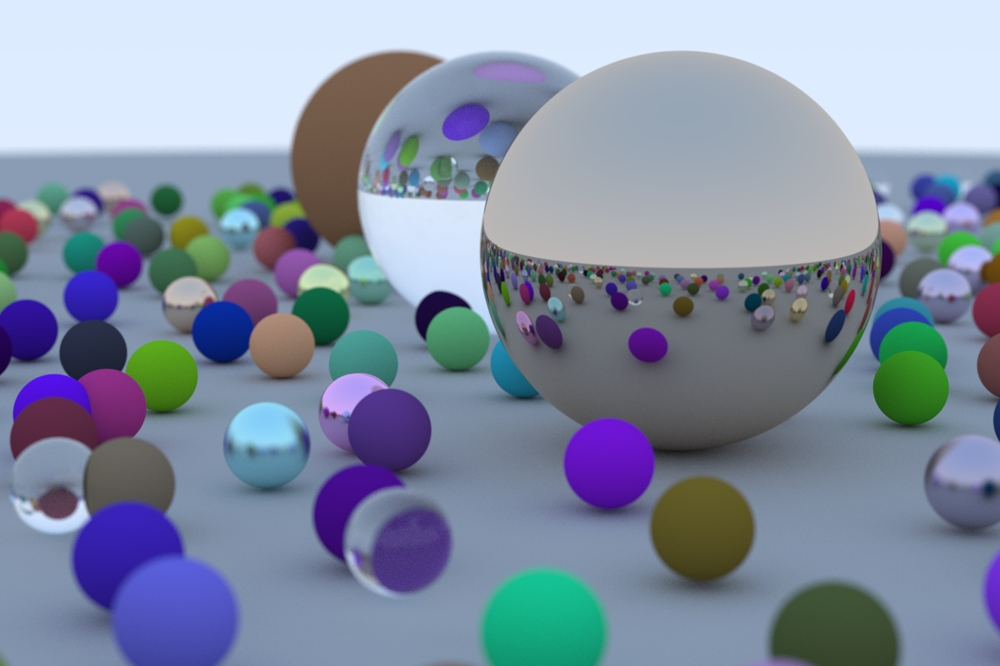

Learning some intro CUDA by following along with [Accelerated Ray Tracing in One Weekend in CUDA](https://developer.nvidia.com/blog/accelerated-ray-tracing-cuda/).

This 1200x800 image took 100 seconds to render on my system (cf. the 5h 19m 52s that the [original took](//boatrite/ray-tracing-in-a-weekend))

